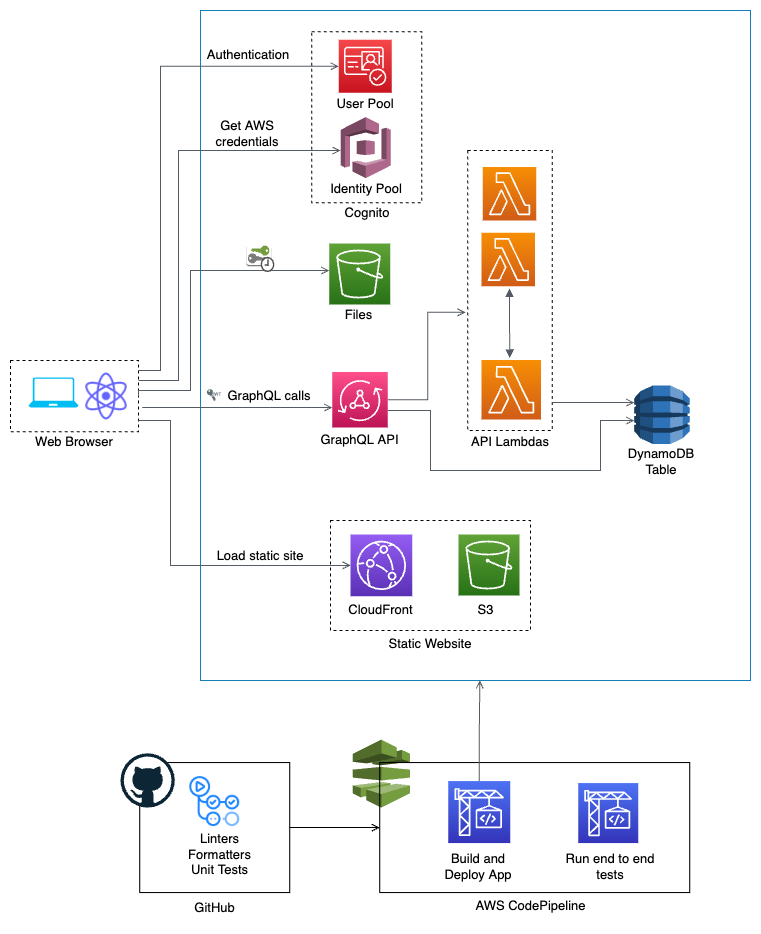

# React-Cognito-AppSync

This is a serverless project to play with React, Chakra UI, Apollo Client, Cognito, AppSync, Lambda and DynamoDB. It's developed using the [AWS CDK](https://aws.amazon.com/cdk/) and structured following [best practices](https://docs.aws.amazon.com/cdk/v2/guide/best-practices.html).

The application is organized into logical units, such as React site, GraphQL API, Cognito user pool, database and deployment pipeline. These logical units are implemented as [CDK Constructs](https://docs.aws.amazon.com/cdk/v2/guide/constructs.html), which include the AWS resources definitions and sometimes also the runtime code. The constructs are later group in [CDK Stacks](https://docs.aws.amazon.com/cdk/v2/guide/stacks.html), which define the deployment models.

The CDK, Lambda functions and React code is written in [TypeScript](https://www.typescriptlang.org/).

**Current Functionalities**

 - Cognito sign in/sign out
 - Cognito new user
 - Cognito change/reset password
 - Small AWS resources dashboard 
 - Write/Read DynamoDB Table

### Architecture

This application uses Cognito for authentication and user management. AppSync is used to implement the GraphQL API and some of the operations run on Lambda Functions. There's also a DynamoDB table with data that is written and read directly from AppSync using VTL templates or through the Lambda functions. 
The website is hosted in a S3 bucket with a CloudFront distribution in front. 



### Project Structure

Each logical unit has a directory that includes the related infrastructure, runtime and configuration code. This way, any developer can easily find the code related to a specific logical unit. 

    .
    ├── cognito
    |   |── cdk.ts                      # CDK construct with Cognito User Pool configuration
    |
    ├── database
    |   |── cdk.ts                      # CDK construct with DynamoDB table resource
    | 
    ├── graphql-api
    |   |── cdk.ts                      # CDK construct with AppSync and Lambda functions resources
    |   |── <Lambda_Function_Name>      # A folder for each Lambda function with the name
    |   |   |── index.ts                # Code for Lambda handler  
    |   |── schema.graphql              # GraphQL schema
    |   |── packages.json               # packages that needs to be bundle with the Lambda
    |
    ├── pipeline                
    |   |── cdk.ts                      # CDK stack with deployment pipeline
    |
    ├── s3-react-app                    # React application
    |   |── cdk.ts                      # CDK construct for static website configuration
    |   |── src                         # React application code
    |   |── packages.json               # packages for React app
    |   |── tsconfig.json               # React TypeScript configuration
    |   |── linters and formatters for React code (.eslintrc.json, prettierrc)  
    |
    |── scripts                         # Useful scripts         
    |
    |── app.ts                          # Main CDK application (Constructs are imported here and deployed within Stacks)
    |
    |── CDK linters, packages and TypeScript configuration (.eslintrc.json, tsconfig.json)
    |
    └── ...

### How to deploy

You can fork this repository and clone it to your local environment.

Then, if you want to deploy the application manually from your computer, please follow the next steps:

1. `yarn install`
2. You can change the name of the app in the [app.js](/app.ts) file. The default name is `React-App`
3. Specify the AWS account number in the following environment variable
    ```
    export AWS_ACCOUNT=
    ```
3. Deploy the following CDK stacks in this order
    ```
    yarn run cdk deploy <app-name>-CognitoStack <app-name>-TableStack`
    yarn run cdk deploy <app-name>-AppSyncStack`
    ```
4. Configure the following environment variables
    ```
    export REACT_APP_USER_POOL_ID=
    export REACT_APP_WEBCLIENT_ID=
    export REACT_APP_API_URL=
    ```
5. Build the React app
    ```
    cd s3-react-ap && yarn build
    ```
6. Deploy the static website
    ```
    yarn run cdk deploy <app-name>-StaticSiteStack`
    ```
7. Create the first Cognito user
    ```
    npx ts-node scripts/create_cognito_user.ts 'email_address' 'name' 'last_name' Admin
    ```
8. You are ready to log into the app! Get the URL from the `<app-name>-StaticSiteStack` output in the previous step. You can also log into the AWS console and find it in the CloudFront distribution.

To deploy the application through the deployment pipeline, follow these steps:

1. Create [AWS CodeStart GitHub connection](https://docs.aws.amazon.com/codepipeline/latest/userguide/connections-github.html)
    - Create SSM parameter for the connection ARN and assign the following name `Github-Connection`
2. Perform steps 2 and 3 from manual deployment above
3. Modify the [app.js](/app.ts) file and enter your Github user and the repo name
```typescript
new CodePipelineStack(app, 'DeploymentPipelineStack', {
  repoOwner: <github_user>,
  repoName: <repo_name>
})
```
4. `yarn install`
5. `yarn run cdk deploy <app-name>-Pipeline-Stack`
6. Please notice that you will have to run the deployment pipeline a few times because of some dependencies between stacks. I could've configured these dependencies manually in the CDK, but then every time you would deploy a change manually, it would take longer, and the same would also apply to the pipeline. 
The idea is to speed up the deployments and feedback loop. 
7. Perform step 7 from above

### Useful commands

* `cdk deploy`      deploy stacks to your AWS account/region
* `cdk diff`        compare deployed stack with current state
* `cdk synth`       emits the synthesized CloudFormation template
